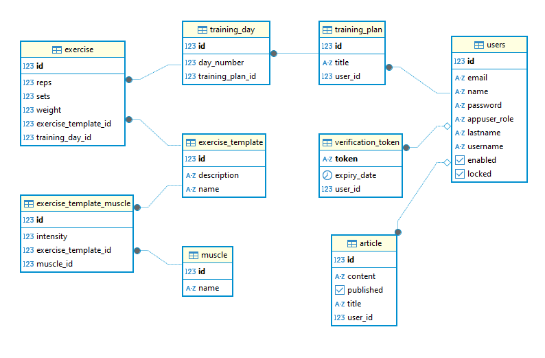

# PureLift – Aplikacja do Zarządzania Treningiem

## Opis projektu

PureLift to aplikacja webowa, która umożliwia użytkownikom kompleksowe zarządzanie swoim planem treningowym. Projekt został zaprojektowany z myślą o osobach aktywnych fizycznie, które chcą:

- tworzyć i przeglądać własne plany treningowe,

- edytować ilość podnoszonych kilogramów,

- śledzić postępy i historię ćwiczeń,

- przeglądać artykuły sportowe.

Aplikacja składa się z nowoczesnego frontendowego interfejsu (React) oraz backendu (Spring Boot), który obsługuje logikę biznesową i dostęp do bazy danych.

## Architektura systemu

#### Frontend został zbudowany przy użyciu biblioteki React z wykorzystaniem Vite jako narzędzia do szybkiego uruchamiania i budowania aplikacji.

Zadania frontendu:

- wyświetlanie interfejsu użytkownika (UI),

- obsługa logowania, rejestracji oraz sesji użytkownika,

- wyświetlanie planów treningowych oraz artykułów sportowych,

- umożliwianie edycji ilości kilogramów i serii dla poszczególnych ćwiczeń,

- komunikacja z backendem za pomocą zapytań HTTP (REST API)

#### Backend został zbudowany w technologii Spring Boot (Java) i odpowiada za logikę biznesową oraz komunikację z bazą danych.

Zadania backendu:

- obsługa zapytań przychodzących z frontendu (GET, POST, PUT, DELETE),

- walidacja danych wejściowych,

- autoryzacja i uwierzytelnianie użytkowników (za pomocą Spring Security),

- logika związana z planami treningowymi, ćwiczeniami i artykułami,

- komunikacja z relacyjną bazą danych ( PostgreSQL).

#### Baza danych(PostgresSQL)

#### System korzysta z relacyjnej bazy danych, PostgreSQL, która przechowuje wszystkie dane:

- informacje o użytkownikach,

- plany treningowe i ćwiczenia,

- artykuły sportowe,

- historię postępów użytkownika.

## Instrukcja uruchomienia

### Backend

#### 1. Przejdź do katalogu backendu:

_cd backend_

#### 2. Zbuduj projekt :

_./gradlew build_

#### 3. Uruchom aplikację:

_./gradlew bootRun_

### Frontend

#### 1. Przejdź do katalogu  frontendowego:

_cd frontend_

#### 2. Zainstaluj zaleznosci:

_npm install_

#### 3. Uruchom serwer:

_npm run dev_

## Technologie i uzasadnienie wyboru

Spring Boot	Backend - Popularny framework w Javie, ułatwia szybkie tworzenie API, wspiera bezpieczeństwo.

React (Vite) - Nowoczesna biblioteka do tworzenia SPA, szybkie odświeżanie dzięki Vite.

PostgreSQL - Stabilna, wydajna baza danych o otwartym kodzie źródłowym, używałem wczesniej.